# Backend Component Diagram

This document maps how the backend components connect in the current codebase.

## High-Level Backend Wiring

```mermaid
flowchart TB
    Client["HTTP client<br/>browser UI, Postman, tests"] --> App["FastAPI app<br/>backend/main.py"]
    Settings["Settings<br/>backend/config.py"] --> App
    App --> Health["GET /healthz"]
    App --> Lifespan["Lifespan shutdown<br/>close DB engine"]
    App --> AuthRouter["Auth router<br/>/auth"]
    App --> ProjectsRouter["Projects router<br/>/projects"]
    App --> PaymentsRouter["Payments router<br/>/payments"]
    App --> WebhooksRouter["Webhooks router<br/>/webhooks"]
    App --> PipelineRouter["Pipeline router<br/>/pipeline"]

    AuthRouter --> AuthSchemas["Auth schemas"]
    AuthRouter --> Security["Security helpers<br/>password hashing, JWT"]
    AuthRouter --> DbSessionDep["DbSession dependency"]

    ProjectsRouter --> ProjectSchemas["Project schemas"]
    ProjectsRouter --> DbSessionDep
    ProjectsRouter --> CurrentUserDep["CurrentUser dependency"]
    ProjectsRouter --> PipelineServiceDep["Pipeline service dependency"]
    ProjectsRouter --> ReferenceServiceDep["Reference-file service dependency"]
    ProjectsRouter --> CreditGuard["require_credits guard"]

    PaymentsRouter --> PaymentSchemas["Payment schemas"]
    PaymentsRouter --> DbSessionDep
    PaymentsRouter --> CurrentUserDep
    PaymentsRouter --> PaymentOrderService["Payment order service"]
    PaymentsRouter --> CreditService["Credit ledger service"]

    WebhooksRouter --> PaymentSchemas
    WebhooksRouter --> DbSessionDep
    WebhooksRouter --> SepayService["Sepay webhook auth and VietQR helpers"]
    WebhooksRouter --> PaymentOrderService

    PipelineRouter --> PipelineHealthSchema["PipelineHealthResponse"]
    PipelineRouter --> PipelineNodeNames["PIPELINE_NODE_NAMES"]

    CurrentUserDep --> Bearer["HTTPBearer"]
    CurrentUserDep --> DecodeToken["decode_access_token"]
    CurrentUserDep --> LoadUser["select User by token subject"]
    DecodeToken --> Security
    LoadUser --> DbSessionDep

    DbSessionDep --> GetDbSession["get_db_session"]
    GetDbSession --> SessionManager["DatabaseSessionManager"]
    Settings --> SessionManager
    SessionManager --> AsyncEngine["SQLAlchemy AsyncEngine"]
    AsyncEngine --> Database[(Relational database)]

    PipelineServiceDep --> PipelineFactory["get_pipeline_service"]
    PipelineFactory --> LiteraturePipelineService["LiteraturePipelineService"]
    LiteraturePipelineService --> ProjectPipelineRunner["ProjectPipelineRunner<br/>LangGraph"]
    ProjectPipelineRunner --> SearcherAgent["SearcherAgent"]
    ProjectPipelineRunner --> ReaderAgent["ReaderAgent"]

    ReferenceServiceDep --> ReferenceFactory["get_reference_file_service"]
    ReferenceFactory --> ReferenceFileService["ReferenceFileService"]
    CreditGuard --> CreditService

    SearcherAgent --> QueryLLM["OpenRouter structured output<br/>query expansion"]
    SearcherAgent --> SemanticScholarClient["Semantic Scholar adapter"]
    SearcherAgent --> ArxivClient["arXiv adapter"]
    SearcherAgent --> ResearchUtils["research_utils"]

    ReaderAgent --> Embeddings["EmbeddingService"]
    ReaderAgent --> SummaryLLM["OpenRouter structured output<br/>summaries"]
    ReaderAgent --> ResearchUtils

    ReferenceFileService --> DocumentExtraction["PaperDocumentExtractionService<br/>uploaded PDF extraction"]
    DocumentExtraction --> OpenRouterPdf["OpenRouter file parser<br/>base64 PDF data URL"]
    ReferenceFileService --> UploadStorage[(Reference PDF storage<br/>REFERENCE_UPLOAD_DIR)]

    AuthRouter --> Models["SQLAlchemy models"]
    ProjectsRouter --> Models
    PaymentsRouter --> Models
    WebhooksRouter --> Models
    SearcherAgent --> Models
    ReaderAgent --> Models
    ReferenceFileService --> Models
    Models --> Database
    Migrations["Alembic migrations"] --> Database

    QueryLLM --> OpenRouterChat["OpenRouter<br/>/chat/completions"]
    SummaryLLM --> OpenRouterChat
    Embeddings --> OpenRouterEmbeddings["OpenRouter<br/>/embeddings"]
    SemanticScholarClient --> SemanticScholarApi["Semantic Scholar Graph API"]
    ArxivClient --> ArxivApi["arXiv Atom API"]

    Settings --> Security
    Settings --> QueryLLM
    Settings --> SummaryLLM
    Settings --> Embeddings
    Settings --> ReferenceFileService
    Settings --> SemanticScholarClient
    Settings --> SepayService
    Settings --> PaymentOrderService

    classDef entry fill:#f6f8fa,stroke:#6e7781,color:#24292f;
    classDef api fill:#e7f5ff,stroke:#1c7ed6,color:#0b3558;
    classDef dependency fill:#fff4e6,stroke:#f08c00,color:#5f370e;
    classDef service fill:#ebfbee,stroke:#37b24d,color:#163b1f;
    classDef persistence fill:#f3f0ff,stroke:#7048e8,color:#2f1b70;
    classDef external fill:#fff0f6,stroke:#d6336c,color:#5c1730;

    class Client,App,Health,Lifespan,Settings entry;
    class AuthRouter,ProjectsRouter,PaymentsRouter,WebhooksRouter,PipelineRouter,AuthSchemas,ProjectSchemas,PaymentSchemas,PipelineHealthSchema,PipelineNodeNames api;
    class DbSessionDep,CurrentUserDep,PipelineServiceDep,ReferenceServiceDep,CreditGuard,Bearer,DecodeToken,LoadUser,GetDbSession,PipelineFactory,ReferenceFactory dependency;
    class Security,LiteraturePipelineService,ProjectPipelineRunner,SearcherAgent,ReaderAgent,ReferenceFileService,CreditService,PaymentOrderService,SepayService,QueryLLM,SummaryLLM,Embeddings,ResearchUtils,DocumentExtraction,SemanticScholarClient,ArxivClient service;
    class SessionManager,AsyncEngine,Database,Models,Migrations,UploadStorage persistence;
    class OpenRouterChat,OpenRouterEmbeddings,SemanticScholarApi,ArxivApi external;
```

## Auth And Admin API Routes

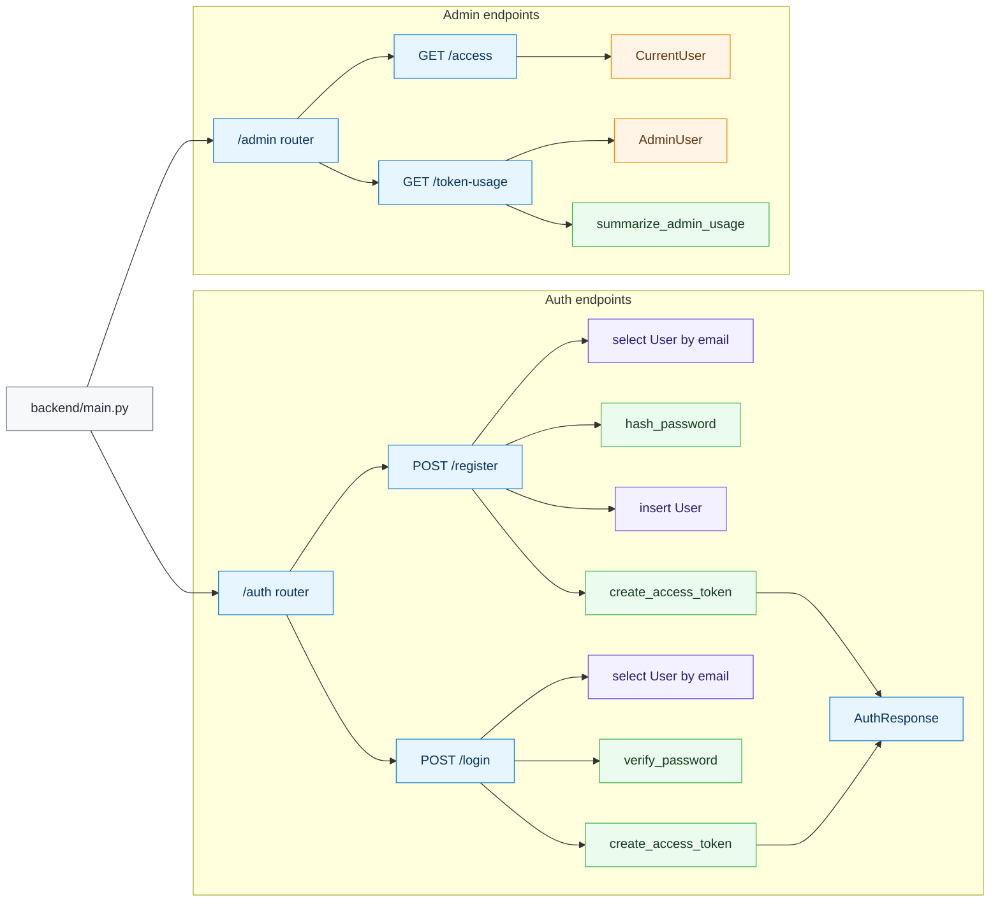

## Project And Pipeline API Routes

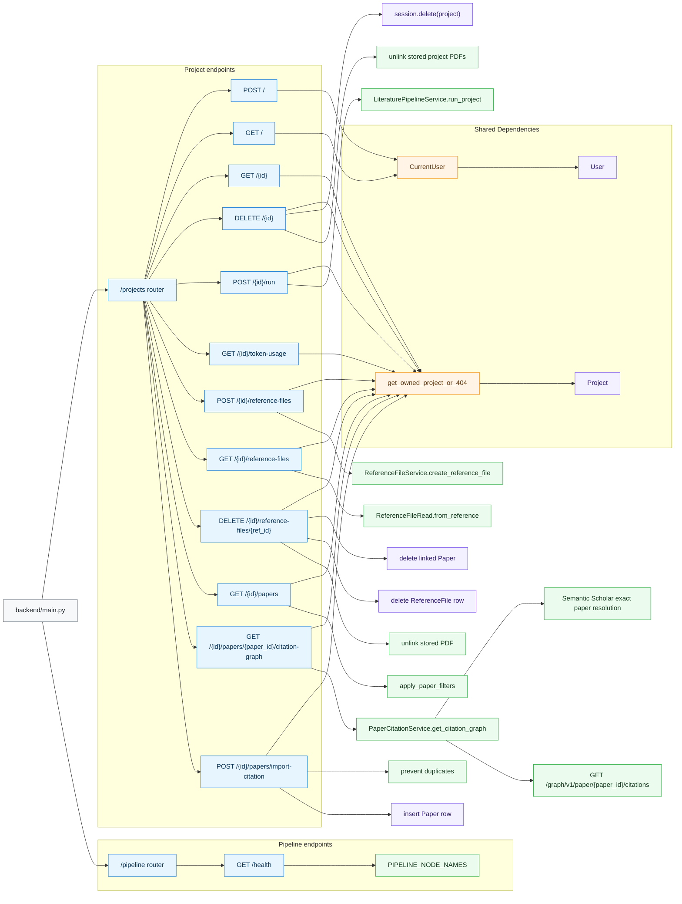

## Credits And Sepay Payment Routes

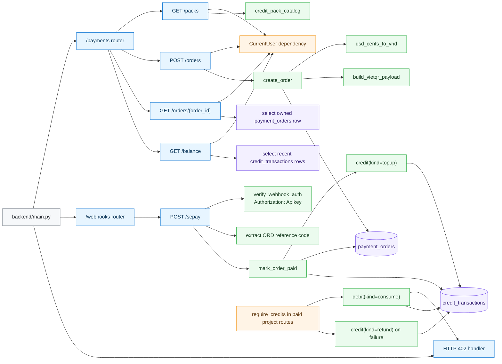

## Authentication And Dependency Flow

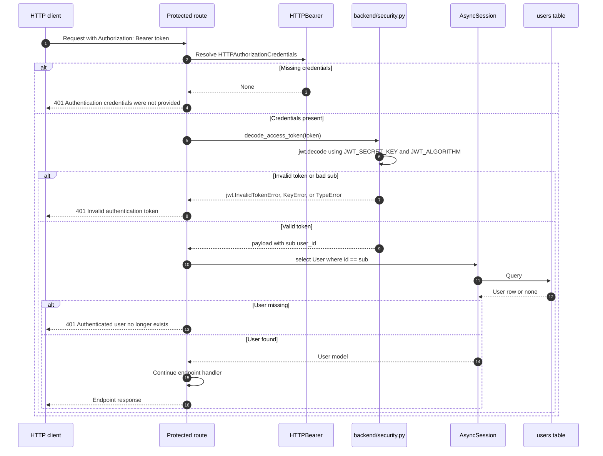

## Project Pipeline Run

`POST /projects/{project_id}/run` executes the research pipeline synchronously and returns completion metadata.

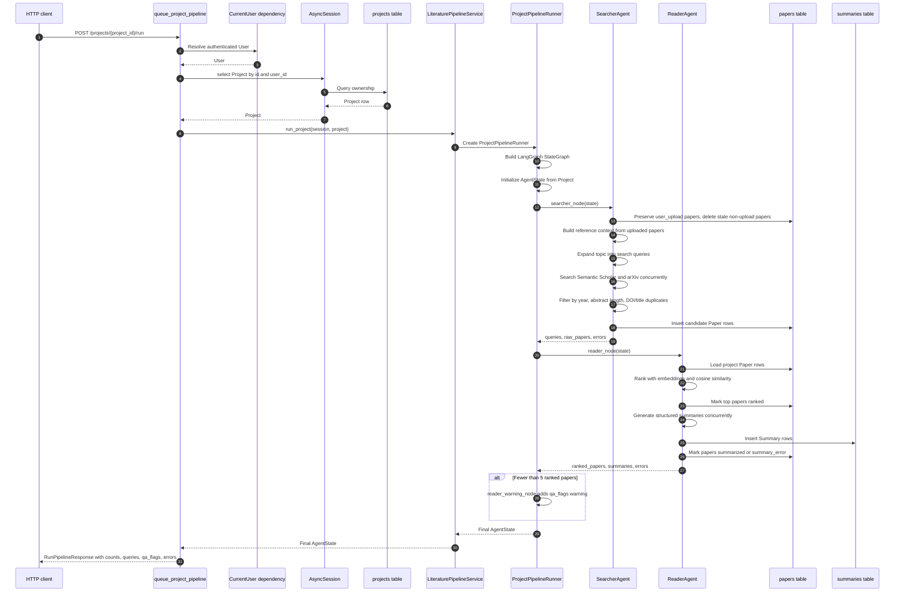

## LangGraph Pipeline Topology

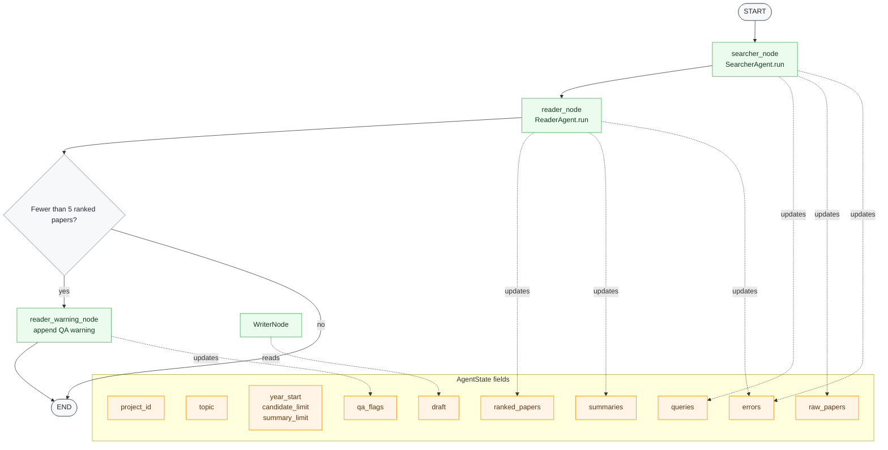

## SearcherAgent Internals

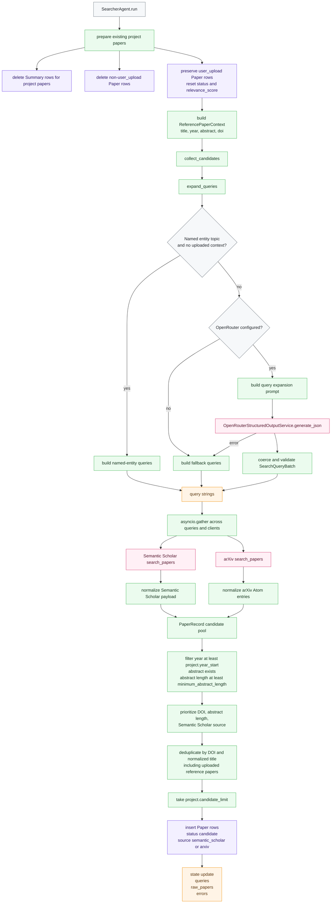

## ReaderAgent Internals

```mermaid
flowchart TB
    classDef entry fill:#f6f8fa,stroke:#6e7781,color:#24292f;
    classDef service fill:#ebfbee,stroke:#37b24d,color:#163b1f;
    classDef persistence fill:#f3f0ff,stroke:#7048e8,color:#2f1b70;
    classDef external fill:#fff0f6,stroke:#d6336c,color:#5c1730;
    classDef state fill:#fff4e6,stroke:#f08c00,color:#5f370e;

    Run["ReaderAgent.run"] --> LoadCandidates["select Paper rows by project_id"]
    LoadCandidates --> HasCandidates{"Any candidates?"}
    HasCandidates -- no --> NoCandidates["return empty ranked_papers and summaries<br/>append error"]
    HasCandidates -- yes --> Rank["rank_papers"]

    Rank --> BuildEmbeddingInputs["Build embedding inputs<br/>topic first<br/>then title + abstract for each paper"]
    BuildEmbeddingInputs --> EmbedLive["EmbeddingService.embed_texts"]
    EmbedLive --> LiveConfigured{"OpenRouter API key configured?"}
    LiveConfigured -- yes --> OpenRouterEmbeddings["POST /embeddings"]
    LiveConfigured -- no --> LocalEmbeddings["embed_texts_locally<br/>hash-token deterministic vectors"]
    OpenRouterEmbeddings -- HTTP error --> LocalFallback["local fallback<br/>append ranking error"]
    OpenRouterEmbeddings --> Score["cosine_similarity(topic, paper) * 100"]
    LocalEmbeddings --> Score
    LocalFallback --> Score

    Score --> Sort["sort papers by relevance_score descending"]
    Sort --> TopPapers["top project.summary_limit papers"]
    TopPapers --> MarkRanked["set status ranked"]
    MarkRanked --> Summarize["summarize top papers concurrently<br/>bounded by summary_concurrency"]

    Summarize --> SummaryConfigured{"Summary generator configured?"}
    SummaryConfigured -- no --> FallbackSummary["build fallback summary from abstract sentences"]
    SummaryConfigured -- yes --> SummaryLLM["OpenRouterStructuredOutputService.generate_json<br/>problem, method, result, relevance"]
    SummaryLLM -- validation or structured-output error --> Retry{"Second attempt available?"}
    Retry -- yes --> SummaryLLM
    Retry -- no --> SummaryError["SummaryGenerationResult<br/>payload none<br/>has_error true"]
    SummaryLLM --> ParsedSummary["PaperSummaryPayload"]
    FallbackSummary --> ParsedSummary

    ParsedSummary --> PersistSummary["insert Summary row<br/>has_error false"]
    SummaryError --> PersistSummaryError["insert Summary row<br/>has_error true<br/>error_message set"]
    PersistSummary --> MarkSummarized["set Paper status summarized"]
    PersistSummaryError --> MarkSummaryError["set Paper status summary_error"]
    MarkSummarized --> Commit["commit transaction"]
    MarkSummaryError --> Commit
    Commit --> ReaderResult["state update<br/>ranked_papers<br/>summaries<br/>errors"]

    class Run,HasCandidates,LiveConfigured,Retry entry;
    class NoCandidates,Rank,BuildEmbeddingInputs,EmbedLive,LocalEmbeddings,LocalFallback,Score,Sort,TopPapers,Summarize,SummaryConfigured,FallbackSummary,SummaryError,ParsedSummary service;
    class LoadCandidates,MarkRanked,PersistSummary,PersistSummaryError,MarkSummarized,MarkSummaryError,Commit persistence;
    class OpenRouterEmbeddings,SummaryLLM external;
    class ReaderResult state;
```

## Reference File Upload Flow

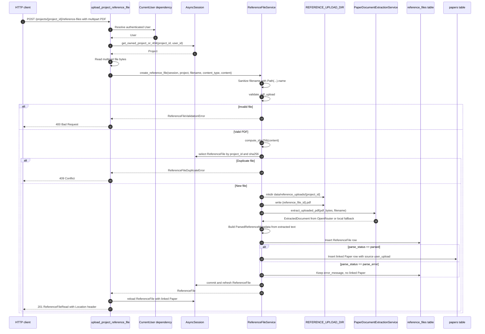

## Reference File Delete Flow

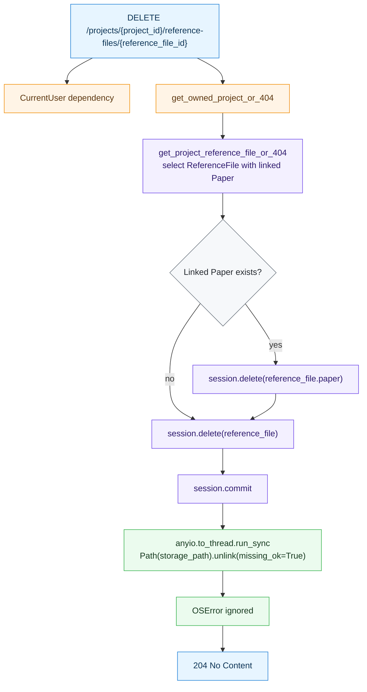

## Database Relationships

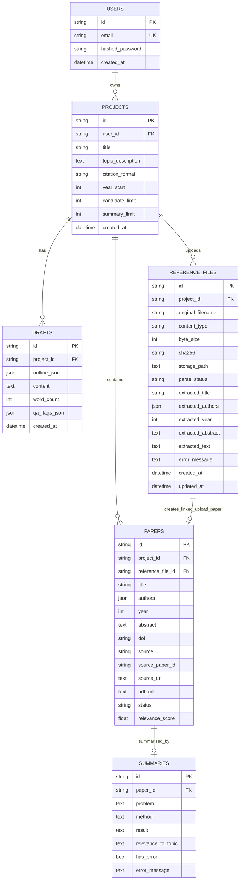

## Data Ownership And Cascade Rules

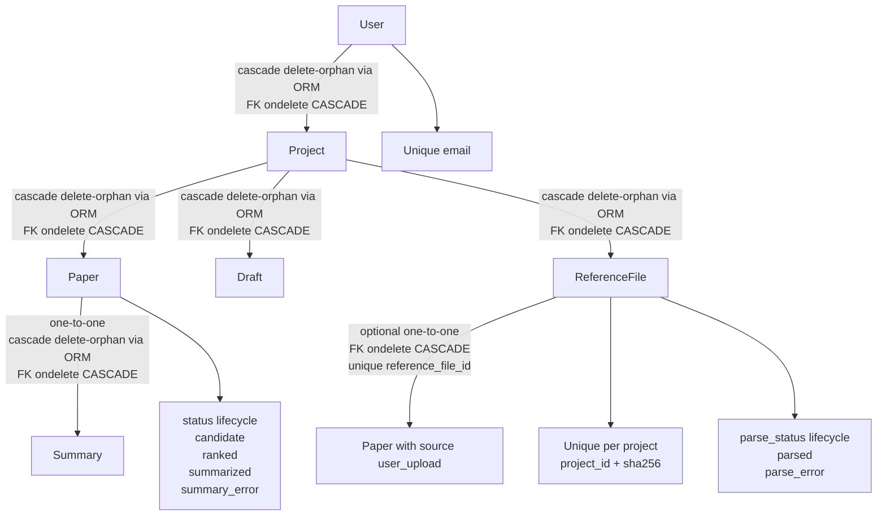

## Configuration And Runtime Settings

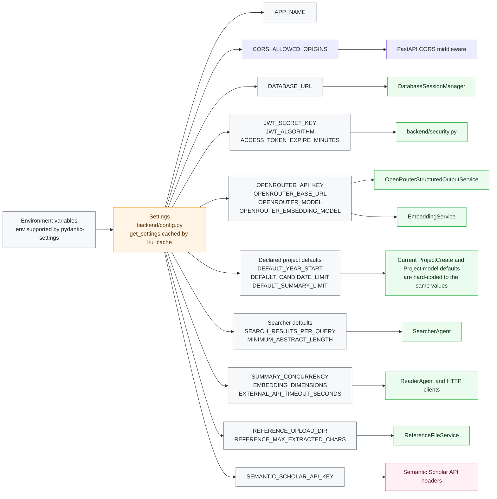

## External Integration Boundaries

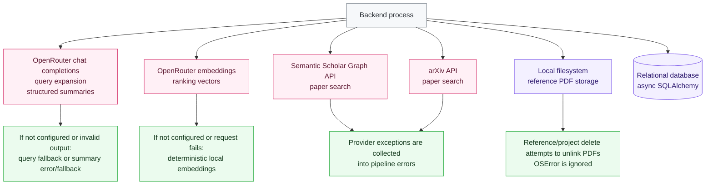

## File-To-Responsibility Map

| Area | Files | Responsibility |
| --- | --- | --- |
| App entrypoint | `backend/main.py` | Creates the FastAPI app, registers configurable CORS middleware and routers, exposes `/healthz`, and closes the default database engine during shutdown. |
| Configuration | `backend/config.py` | Loads cached runtime settings from environment variables and `.env`, including comma-separated CORS origins. |
| Security | `backend/security.py` | Password hashing and verification, JWT creation, and JWT decoding. |
| API dependencies | `backend/api/dependencies.py` | Provides `DbSession`, authenticated `CurrentUser`, allowlisted `AdminUser`, `LiteraturePipelineService`, and `ReferenceFileService`. |
| Routers | `backend/api/routers/auth.py`, `backend/api/routers/admin.py`, `backend/api/routers/projects.py`, `backend/api/routers/pipeline.py` | Own HTTP endpoint behavior and convert service/domain errors into HTTP responses. |
| Schemas | `backend/api/schemas/auth.py`, `backend/api/schemas/admin.py`, `backend/api/schemas/projects.py` | Define request and response payloads. |
| Database | `backend/db/base.py`, `backend/db/session.py`, `backend/db/models.py`, `backend/db/migrations/` | Define ORM models, async sessions, and Alembic schema changes. |
| Pipeline orchestration | `backend/agents/pipeline.py`, `backend/agents/graph.py`, `backend/agents/state.py` | Build and run the LangGraph pipeline for a project. |
| Search agent | `backend/agents/searcher.py` | Expands queries, calls search providers, filters and deduplicates candidates, and persists candidate papers. |
| Reader agent | `backend/agents/reader.py` | Ranks papers with embeddings, generates structured summaries, and persists summary records. |
| Reference uploads | `backend/services/reference_files.py` | Validates, stores, parses, and persists uploaded reference PDFs and linked paper rows. |
| AI usage telemetry | `backend/services/ai_usage.py`, `backend/db/models.py` | Collect provider-reported OpenRouter usage per successful project request and aggregate it by project, day, feature, model, user, and recent event. |
| External clients | `backend/services/semantic_scholar.py`, `backend/services/arxiv.py`, `backend/services/llm.py`, `backend/services/embeddings.py` | Integrate with external search, chat, and embedding APIs while providing local fallbacks where available. |
| Shared utilities | `backend/services/paper_types.py`, `backend/services/research_utils.py` | Define normalized paper payloads and shared research text/math utilities. |
