# Database Schema

This document describes the database schema for the Automated Literature Review application. The backend uses SQLAlchemy 2.0 (async) with Alembic migrations. Schema changes must be applied as Alembic revisions in `backend/db/migrations/`.

## Overview

The schema is organized into five domains:

| Domain | Tables |
|--------|--------|
| **Auth & Billing** | `users`, `credit_transactions`, `payment_orders` |
| **Research projects** | `projects`, `papers`, `summaries`, `paper_documents`, `paper_chunks`, `reference_files` |
| **Conversations** | `paper_conversations`, `paper_messages`, `project_conversations`, `project_messages` |
| **Pipeline outputs** | `drafts`, `writer_outputs`, `deep_search_runs`, `deep_search_sources`, `ai_usage_events` |
| **Writer documents** | `writer_documents`, `writer_sections`, `writer_section_versions`, `writer_document_sources` |

All primary keys are UUID strings (`String(36)`) generated at the application layer via `uuid4()`. Foreign keys use `ON DELETE CASCADE` unless otherwise noted, so deleting a parent row cleans up its dependents.

## Entity-Relationship Diagram

```mermaid
erDiagram
    users {
        string id PK
        string email UK
        string hashed_password
        string auth_provider
        string google_sub UK
        int credit_balance
        string country_code
        datetime created_at
    }

    projects {
        string id PK
        string user_id FK
        string title
        text topic_description
        string citation_format
        int year_start
        int candidate_limit
        int summary_limit
        datetime created_at
    }

    papers {
        string id PK
        string user_id FK
        string project_id FK
        string reference_file_id FK
        string title
        json authors
        int year
        text abstract
        string doi
        string source
        string source_paper_id
        text source_url
        text pdf_url
        int citation_count
        int reference_count
        string status
        float relevance_score
    }

    summaries {
        string id PK
        string paper_id FK
        text problem
        text method
        text result
        text relevance_to_topic
        bool has_error
        text error_message
    }

    paper_documents {
        string id PK
        string paper_id FK
        string status
        text source_pdf_url
        string openrouter_file_hash
        int page_count
        text error_message
        datetime extracted_at
    }

    paper_chunks {
        string id PK
        string paper_id FK
        int chunk_index
        int page_start
        int page_end
        string section_title
        text content
        json embedding_json
    }

    paper_conversations {
        string id PK
        string paper_id FK
        datetime created_at
        datetime updated_at
    }

    paper_messages {
        string id PK
        string conversation_id FK
        string role
        text content
        datetime created_at
    }

    project_conversations {
        string id PK
        string project_id FK
        json selected_paper_ids_json
        datetime created_at
        datetime updated_at
    }

    project_messages {
        string id PK
        string conversation_id FK
        string role
        text content
        datetime created_at
    }

    drafts {
        string id PK
        string project_id FK
        json outline_json
        text content
        int word_count
        json qa_flags_json
        datetime created_at
    }

    writer_outputs {
        string id PK
        string project_id FK
        json selected_paper_ids_json
        json paper_snapshot_json
        text instruction
        string output_target
        string citation_mode
        string reference_style
        bool include_references
        int max_words
        text body
        json references_json
        json bibtex_entries_json
        text thebibliography_text
        json citations_used_json
        json warnings_json
        json qa_flags_json
        datetime created_at
        datetime updated_at
    }

    writer_documents {
        string id PK
        string user_id FK
        string project_id FK
        string title
        text topic
        text thesis
        string paper_type
        string citation_style
        text preamble
        json source_paper_ids_json
        text bib_text
        string status
        datetime created_at
        datetime updated_at
    }

    writer_sections {
        string id PK
        string writer_document_id FK
        string section_type
        int order_index
        string title
        text outline_text
        json user_inputs_json
        text draft_latex
        json low_confidence_spans_json
        json cited_paper_ids_json
        string status
        datetime updated_at
    }

    writer_section_versions {
        string id PK
        string writer_section_id FK
        text draft_latex
        datetime created_at
    }

    writer_document_sources {
        string id PK
        string writer_document_id FK
        string paper_id FK
        string source_origin
        text notes
        int order_index
        datetime created_at
        datetime updated_at
    }

    reference_files {
        string id PK
        string user_id FK
        string project_id FK
        string original_filename
        string content_type
        int byte_size
        string sha256
        text storage_path
        string parse_status
        string extracted_title
        json extracted_authors
        int extracted_year
        text extracted_abstract
        text extracted_text
        text error_message
        datetime created_at
        datetime updated_at
    }

    deep_search_runs {
        string id PK
        string project_id FK
        text user_prompt
        string status
        string mode
        json selected_paper_ids_json
        json plan_json
        text report_body
        json source_summary_json
        json warnings_json
        json qa_flags_json
        datetime created_at
        datetime updated_at
        datetime completed_at
    }

    deep_search_sources {
        string id PK
        string run_id FK
        string paper_id FK
        string source_type
        string title
        text url
        text snippet
        json metadata_json
        datetime created_at
    }

    credit_transactions {
        string id PK
        string user_id FK
        int delta
        int balance_after
        string kind
        string feature
        string reference_id
        json metadata_json
        datetime created_at
    }

    payment_orders {
        string id PK
        string user_id FK
        string pack_id
        int credits
        int usd_amount
        int vnd_amount
        float fx_rate_usd_to_vnd
        string reference_code UK
        string sepay_va_account
        string sepay_va_bank_bin
        text qr_payload
        string status
        string sepay_transaction_id UK
        datetime created_at
        datetime paid_at
        datetime expires_at
    }

    ai_usage_events {
        string id PK
        string user_id FK
        string project_id FK
        string provider
        string endpoint
        string feature
        string model
        string status
        int prompt_tokens
        int completion_tokens
        int total_tokens
        int reasoning_tokens
        int cached_tokens
        float cost_credits
        json metadata_json
        datetime created_at
    }

    users ||--o{ projects : "owns"
    users ||--o{ writer_documents : "owns"
    users ||--o{ credit_transactions : "has"
    users ||--o{ payment_orders : "places"
    users ||--o{ ai_usage_events : "generates"
    users ||--o{ reference_files : "uploads"

    projects ||--o{ papers : "contains"
    projects ||--o{ drafts : "has"
    projects ||--o{ writer_outputs : "has"
    projects ||--o{ project_conversations : "has"
    projects ||--o{ reference_files : "stores"
    projects ||--o{ deep_search_runs : "runs"
    projects ||--o{ ai_usage_events : "tracks"
    projects ||--o{ writer_documents : "linked to"

    papers ||--|| summaries : "has"
    papers ||--|| paper_documents : "has"
    papers ||--o{ paper_chunks : "chunked into"
    papers ||--o{ paper_conversations : "has"
    papers ||--o{ deep_search_sources : "cited in"
    papers ||--o{ writer_document_sources : "sourced by"
    papers ||--o| reference_files : "linked from"

    paper_conversations ||--o{ paper_messages : "contains"
    project_conversations ||--o{ project_messages : "contains"

    deep_search_runs ||--o{ deep_search_sources : "cites"

    writer_documents ||--o{ writer_sections : "has"
    writer_documents ||--o{ writer_document_sources : "uses"
    writer_sections ||--o{ writer_section_versions : "versioned by"
```



## Domain detail

### Auth & Billing

- **`users`** — Account record. Supports both email/password (`hashed_password`) and Google OAuth (`google_sub`). `credit_balance` is the cached running balance kept in sync with `credit_transactions`. `country_code` (default `VN`) is used by FX/SePay flows. Admins listed in `ADMIN_EMAILS` bypass credit gating.
- **`credit_transactions`** — Append-only ledger. Each row records a `delta` and the resulting `balance_after`. `kind` distinguishes signup grants, top-up purchases, feature debits, refunds, and admin grants. `feature` tags which gated feature consumed the credits; `reference_id` ties back to a `payment_orders.id` or a domain event.
- **`payment_orders`** — SePay/VietQR top-up orders. Stores both USD and VND amounts plus the FX rate snapshot, the virtual-account/QR payload, and lifecycle timestamps (`created_at`, `paid_at`, `expires_at`). `reference_code` and `sepay_transaction_id` are unique to enforce idempotent settlement from the `/webhooks/sepay` handler.

### Research projects

- **`projects`** — Root container for a literature-review effort. Stores topic prompt, citation format, year window, and pipeline limits (`candidate_limit`, `summary_limit`). Deletion cascades to papers, drafts, writer outputs, conversations, reference files, AI usage events, and deep-search runs.
- **`papers`** — Candidate or selected paper records produced by the Searcher node (Semantic Scholar / arXiv) or uploaded as a reference. `status` flows `candidate` → `selected` → `summarized`. `reference_file_id` is set (with a `UNIQUE` constraint) when the paper was sourced from a user-uploaded PDF rather than discovered via search. `relevance_score` comes from the embedding rerank.
- **`summaries`** — One-to-one structured summary produced by the Reader node: `problem`, `method`, `result`, `relevance_to_topic`. `has_error` + `error_message` capture LLM/extraction failures so the UI can show a retry banner.
- **`paper_documents`** — One-to-one extraction-state record per paper. Tracks PDF ingestion status, OpenRouter file cache hash, and page count. Drives grounded paper-conversation availability.
- **`paper_chunks`** — Paginated chunks produced by `document_extraction.py` (PyMuPDF). Each chunk has page range, section title, content, and a JSON-serialized embedding vector used for grounding retrieval.
- **`reference_files`** — User-uploaded reference PDFs. SHA256 + `project_id` are unique to deduplicate. Stores extracted metadata (title, authors, year, abstract, full text) and parsing status. Optionally linked to a `papers` row.

### Conversations

- **`paper_conversations`** + **`paper_messages`** — Grounded chat on a single paper. Messages have `role` (`user` / `assistant`) and ordered timestamps.
- **`project_conversations`** + **`project_messages`** — Cross-paper chat scoped to a project. `selected_paper_ids_json` snapshots which papers were in scope when the conversation began.

### Pipeline outputs

- **`drafts`** — Legacy writer output (used by the original LangGraph Writer node). Holds an outline JSON, the synthesized body, QA flags, and a cached `word_count`.
- **`writer_outputs`** — Result of the standalone `POST /projects/{id}/writer/generate` flow. Captures the user instruction, output target/citation mode/reference style, and the rendered body alongside paper snapshots, BibTeX entries, `\thebibliography` text, citation keys used, warnings, and QA flags.
- **`deep_search_runs`** — One record per Deep Search invocation. Stores the user prompt, plan JSON (steps + queries), mode (`standard` / `extended`), selected paper IDs, report body, source summary, warnings, and QA flags. Lifecycle: `running` → `succeeded` / `failed`.
- **`deep_search_sources`** — Per-run citations. Each source has a `source_type` (web, library paper, etc.) and optionally a `paper_id` reference (`ON DELETE SET NULL` so deleting a paper does not destroy the historical run).
- **`ai_usage_events`** — Append-only token-usage log used by the admin usage dashboard. Records provider, endpoint, feature, model, prompt/completion/reasoning/cached token counts, status, and a credits cost estimate.

### Writer documents

- **`writer_documents`** — A long-form writer project (separate from the legacy `drafts` flow). Tracks title, topic, thesis, paper type (`imrad` etc.), citation style, optional preamble, the source paper ID list, and a free-form `bib_text` block. Linked to a parent `project` via `ON DELETE SET NULL` so a writer document survives a project deletion.
- **`writer_sections`** — Ordered sections within a writer document. Holds outline text, user inputs JSON, the current `draft_latex`, low-confidence spans (driving the editor highlighter), cited paper IDs, and status.
- **`writer_section_versions`** — Snapshots of `draft_latex` after every accepted edit from `WriterEditorOverlay` (via `WriterDocumentService.save_section_edit()`). Provides revision history.
- **`writer_document_sources`** — Junction between a writer document and the papers it cites. Unique on `(writer_document_id, paper_id)`. `source_origin` distinguishes manual additions from auto-imported library papers; `order_index` controls reference-list ordering.

## Indexes and constraints worth knowing

- `users.email`, `users.google_sub`, and `payment_orders.reference_code` / `payment_orders.sepay_transaction_id` are `UNIQUE` — used for login lookups and idempotent webhook handling.
- `reference_files` has `UNIQUE(project_id, sha256)` so the same PDF cannot be uploaded twice to the same project.
- `paper_chunks` has `UNIQUE(paper_id, chunk_index)` to keep chunk numbering monotonic.
- `writer_document_sources` has `UNIQUE(writer_document_id, paper_id)` plus an index on `(writer_document_id, order_index)` for ordered fetches.
- Hot-path composite indexes: `ix_credit_transactions_user_created_at`, `ix_payment_orders_user_created_at`, `ix_payment_orders_status_expires_at`, `ix_ai_usage_events_project_created_at`, `ix_deep_search_runs_project_created_at`.

## Migrations

New schema changes must ship as Alembic revisions under `backend/db/migrations/versions/`. Keep `backend/db/models.py`, the corresponding migration, `database_schema.sql`, frontend DTOs (`frontend/lib/api.ts`), API schemas (`backend/api/schemas/`), and this document in sync.

Run pending migrations locally with:

```bash
uv run alembic upgrade head
```
