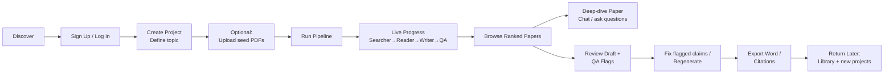
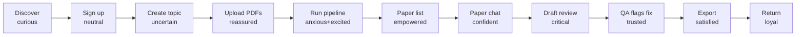

# User Journey Map

This document captures the planned end-to-end user journey for the Automated Literature Review product. It is synthesized from `README.md`, `CORE_FEATURES.md`, `USER_STORIES.md`, and the delivery plans in `plans/` (phases 1–5 including phase 3A).

Use this as a shared reference when designing UI, prioritizing backlog items, or evaluating whether a proposed change helps or hurts the core user flow.

## Primary Persona

- **Minh — PhD candidate (NCS)** writing a thesis-related literature review.
- **Secondary — Lecturer / Researcher** preparing a grant proposal.

**Goal:** Move from a fuzzy research topic to a defensible draft literature review and a ranked paper library in roughly 90 seconds of wall-clock pipeline time, with minimal manual triage.

## High-Level Flow

## Stage-by-Stage Journey

### Stage 1 — Discover & decide to try

- **User goal:** Find a faster alternative to 2–4 months of manual literature review.
- **User actions:** Lands on the app, reads pitch, clicks "Try it."
- **System:** Public landing + live demo URL (Phase 4/5).
- **Feeling:** Skeptical but curious — "Can AI really do this without hallucinating?"
- **Pain points:** Trust in AI-generated research is low.
- **Opportunity:** Show the QA-flagging moment on the landing page; demo GIF.

### Stage 2 — Sign up / log in

- **User goal:** Get access quickly.
- **User actions:** Register with email/password, or login.
- **System:** `POST /auth/register`, `POST /auth/login` → JWT.
- **Touchpoints:** `/register`, `/login` (planned Phase 4).
- **Feeling:** Neutral; wants friction-free onboarding.
- **Pain points:** Password reset / SSO not in plan yet.
- **Opportunity:** Pre-fill with a demo project for first login.

### Stage 3 — Create project & define topic

- **User goal:** Translate a vague research idea into a runnable project.
- **User actions:** Enter title, topic description (natural language), year range, citation format (IEEE / APA / Chicago), candidate / summary limits.
- **System:** `POST /projects` persists project defaults.
- **Touchpoint:** `/projects/new` (Phase 4).
- **Feeling:** "Will it understand my messy topic?"
- **Pain points:** No guidance on what makes a good topic description; no topic-quality feedback.
- **Opportunity:** Inline placeholder examples, topic quality hints (Phase 5 UX work).

### Stage 4 — (Optional) Upload seed reference PDFs

- **User goal:** Bring existing reading into the system so results are anchored.
- **User actions:** Drag-and-drop PDFs into the project.
- **System:** `POST /projects/{id}/reference-files` → validate, hash-dedup, store under `data/reference_uploads/`, parse with PyMuPDF, create a linked `Paper` with `source=user_upload`. Used later as LLM query-expansion context and for dedup.
- **Feeling:** Relief — "The system respects what I already know."
- **Pain points:** Only publicly downloadable PDFs work for Phase 3A Q&A; scanned PDFs without text degrade silently (no OCR in v1).
- **Opportunity:** Surface "couldn't extract text" early and offer gap messaging.

### Stage 5 — Run the research pipeline

- **User goal:** Turn the topic into ranked, summarized knowledge.
- **User actions:** Clicks "Run."
- **System:** `POST /projects/{id}/run` triggers the LangGraph pipeline:
  - **Searcher:** expand into 5–8 queries, call Semantic Scholar + arXiv in parallel, filter/dedup, preserve uploaded papers.
  - **Reader:** embed topic + abstracts (OpenRouter), cosine-rank, summarize top N structurally (Problem / Method / Result / Relevance).
  - **Writer (Phase 3, planned):** cluster themes, draft sections in parallel with strict academic prose rules, inject numbered citations.
  - **QA (Phase 3, planned):** flag uncited claims, duplicates, weak sections, coherence issues.
- **Touchpoint:** `/projects/{id}/run` with a 4-step progress bar + SSE live logs (Phase 4).
- **Feeling:** Anxious + excited — watching agents work is the "wow" moment.
- **Pain points:** 60–90s wait; opaque failures if APIs are slow; expensive if unbounded.
- **Opportunity:** Real-time per-paper log lines ("Summarizing 23/30"), token-budget guard, fallback cached run for demo (Phase 5).

### Stage 6 — Browse ranked paper list

- **User goal:** Quickly decide which papers matter.
- **User actions:** Sort by relevance, filter by year or relevance slider, expand cards to see structured summary, check/uncheck to include/exclude.
- **System:** `GET /projects/{id}/papers?status=...&min_relevance=...` paginated; summaries joined.
- **Touchpoint:** `/projects/{id}/papers`.
- **Feeling:** Empowered — "I can triage 30 papers in minutes."
- **Pain points:** Relevance score may feel like a black box; no "why this was ranked high" explanation.
- **Opportunity:** Show per-paper evidence snippet, allow re-rank with user feedback.

### Stage 7 — Deep-dive into a paper (Phase 3A)

- **User goal:** Understand a specific paper without reading the PDF end-to-end.
- **User actions:** Pick a paper → ask questions in a chat panel.
- **System:** Phase 3A (planned) extracts the PDF via OpenRouter + Gemini, chunks and embeds the content, stores `paper_documents` / `paper_chunks`, retrieves top-k chunks per question, persists `paper_conversations` / `paper_messages`, and answers grounded to the paper; falls back to abstract + summary if extraction fails.
- **Touchpoint:** Per-paper drawer/modal (planned, UI not yet specified).
- **Feeling:** Confident — "I can interrogate the paper like a tutor."
- **Pain points:** Scanned-only PDFs → limited answers; latency on first ask while extraction runs.
- **Opportunity:** Show a "grounded vs fallback" badge so users know the answer's evidence source.

### Stage 8 — Review the draft literature review

- **User goal:** Confirm the draft is good enough to build on.
- **User actions:** Scroll outline, read sections, jump to inline citations, inspect QA flags (yellow: missing citation; orange: coherence issue).
- **System:** Draft served from `drafts` table with `qa_flags_json`; outline navigation; reference list.
- **Touchpoint:** `/projects/{id}/draft`.
- **Feeling:** Critical reviewer mode — "Trust but verify."
- **Pain points:** Draft quality varies; users may mistrust AI paragraphs.
- **Opportunity:** QA-flag UX is the key trust lever — each flag must explain *why* and suggest a fix (Phase 3 plan requires this).

### Stage 9 — Iterate / regenerate

- **User goal:** Improve weak sections without starting over.
- **User actions:** Exclude irrelevant papers, adjust limits, rerun.
- **System:** Rerun preserves uploads, re-searches / ranks / summarizes, regenerates draft.
- **Feeling:** Productive — this is the "second draft" workflow academics expect.
- **Pain points:** Cost per run (~$0.26+); no partial regeneration per section in current plan.
- **Opportunity:** Add "regenerate only this section" (Phase 5 polish).

### Stage 10 — Export

- **User goal:** Take the work into their real workflow (Word / LaTeX).
- **User actions:** Clicks "Download Word" and "Copy citations."
- **System:** `GET /projects/{id}/export/docx` + `/export/citations` (Phase 3 planned, not yet implemented).
- **Touchpoint:** Export bar in the draft screen.
- **Feeling:** Satisfied — tangible output they can paste into a thesis/proposal.
- **Pain points:** Planned edge cases: Word on Windows rendering, LaTeX not yet in scope, journal-specific templates missing.
- **Opportunity:** Add per-journal template toggle (IEEE / ACM / Springer) in Phase 5.

### Stage 11 — Return & manage library

- **User goal:** Run more projects, keep an organized library.
- **User actions:** Views project list, revisits prior drafts, uploads more PDFs.
- **System:** `GET /projects` list, per-project paper library; multi-project already supported.
- **Feeling:** Invested — the product becomes a research workspace.
- **Pain points:** Tagging / annotations are roadmap items (P1 / Nice).
- **Opportunity:** Gap-analysis + PDF-upload suggestions (already listed in `CORE_FEATURES.md` as P1 nice-to-have).

## Emotional Curve (Planned Ideal)

## Critical Moments Of Truth

The moments where the product wins or loses the user:

- **First 10s of Stage 5** — pipeline must feel alive (SSE progress is essential).
- **Paper list quality in Stage 6** — if top 5 look irrelevant, the user churns.
- **QA-flag clarity in Stage 8** — the demo-defining "system caught a missing citation" moment (Phase 5 goal).
- **Export fidelity in Stage 10** — a broken Word file is a reputational loss.

## Gap Check Versus Current Code

Stages not yet implemented in the codebase (highest risks to the journey today):

- **Stage 5** — Writer + QA agents are no-ops in `backend/agents/graph.py`.
- **Stage 7** — Paper deep-dive chat (Phase 3A — no tables or routes exist yet).
- **Stage 8** — QA-flagged draft viewer.
- **Stage 10** — Word / citation export endpoints.
- **Stage 5 (UI)** — Real-time SSE streaming UI (Phase 4 work).

## Related Documents

- `README.md` — product overview and current phase scope.
- `CORE_FEATURES.md` — required vs nice-to-have feature list.
- `USER_STORIES.md` — primary persona stories.
- `plans/README.md` — 6-week delivery plan index.
- `plans/phase-1-foundation.md` through `plans/phase-5-polish-demo.md` — per-phase deliverables.
- `plans/phase-3a-paper-understanding.md` — paper conversation track.
- `docs/backend-diagram.md` — backend architecture diagrams.
