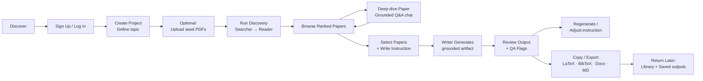
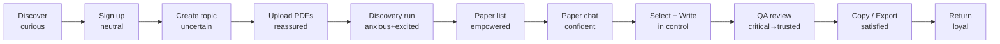

# User Journey Map

This document captures the current and planned end-to-end user journey for the Automated Literature Review product. It is synthesized from `README.md`, `CORE_FEATURES.md`, `USER_STORIES.md`, and the delivery plans in `plans/`.

Use this as a shared reference when designing UI, prioritizing backlog items, or evaluating whether a proposed change helps or hurts the core user flow.

Status note:

- Shipped frontend today: login plus a chat-style workspace in `frontend/` that can create projects, run discovery, list ranked papers in context, and start grounded paper conversations.
- Planned frontend still missing: the full stage-based UI for reference-file management, paper drill-down workflows, writer workspace, downloads, and richer iteration tools.

> **Paradigm note (post phase 3 refactor):** The product is no longer "push one button and get a full literature review." Paper discovery is automatic (`searcher → reader`), but **Writer + QA are user-invoked after paper selection**. The user picks papers, writes an instruction, picks an output format (LaTeX, docs, markdown, plain text), and receives a grounded, QA-validated artifact (prose, references, BibTeX, etc.).

## Primary Persona

- **Minh — PhD candidate (NCS)** writing a thesis-related literature review.
- **Secondary — Lecturer / Researcher** preparing a grant proposal.

**Goal:** Move from a fuzzy research topic to (a) a ranked, summarized paper library in roughly 90 seconds and (b) grounded, copy-ready writing artifacts (related work section, reference list, BibTeX, etc.) generated on demand from a user-selected subset of those papers.

## High-Level Flow

## Stage-by-Stage Journey

### Stage 1 — Discover & decide to try

- **User goal:** Find a faster alternative to 2–4 months of manual literature review.
- **User actions:** Lands on the app, reads pitch, clicks "Try it."
- **System:** Public landing + live demo URL (Phase 4/5).
- **Feeling:** Skeptical but curious — "Can AI really do this without hallucinating?"
- **Pain points:** Trust in AI-generated research is low.
- **Opportunity:** Show the grounded Q&A + QA-flag moments on the landing page; demo GIF.

### Stage 2 — Sign up / log in

- **User goal:** Get access quickly.
- **User actions:** Register with email/password, or login.
- **System:** `POST /auth/register`, `POST /auth/login` → JWT.
- **Touchpoints:** `/login` is shipped in the current frontend. A more complete onboarding flow is still planned.
- **Feeling:** Neutral; wants friction-free onboarding.
- **Pain points:** Password reset / SSO not in plan yet.
- **Opportunity:** Pre-fill with a demo project for first login.

### Stage 3 — Create project & define topic

- **User goal:** Translate a vague research idea into a runnable project.
- **User actions:** Enter title, topic description (natural language), year range, candidate / summary limits. Citation format is no longer a project-level lock — it is chosen per writer request in Stage 8.
- **System:** `POST /projects` persists project defaults.
- **Touchpoint:** Project creation is currently driven from the chat workspace on first message. A dedicated creation screen remains planned.
- **Feeling:** "Will it understand my messy topic?"
- **Pain points:** No guidance on what makes a good topic description; no topic-quality feedback.
- **Opportunity:** Inline placeholder examples, topic quality hints.

### Stage 4 — (Optional) Upload seed reference PDFs

- **User goal:** Bring existing reading into the system so results are anchored.
- **User actions:** Drag-and-drop PDFs into the project.
- **System:** `POST /projects/{id}/reference-files` → validate, hash-dedup, store under `data/reference_uploads/`, parse with PyMuPDF, create a linked `Paper` with `source=user_upload`. Used as LLM query-expansion context during discovery and as a candidate for ranking, summarization, and writer selection.
- **Feeling:** Relief — "The system respects what I already know."
- **Pain points:** Scanned PDFs without text degrade silently (no OCR in v1).
- **Opportunity:** Surface "couldn't extract text" early and offer gap messaging.

### Stage 5 — Run discovery pipeline (Searcher → Reader)

- **User goal:** Turn the topic into a ranked, summarized paper shortlist.
- **User actions:** Clicks "Run."
- **System:** `POST /projects/{id}/run` executes the LangGraph discovery graph:
  - **Searcher:** expand into 5–8 queries, call Semantic Scholar + arXiv in parallel, filter/dedup, preserve uploaded papers, prefer extraction-friendly PDF URLs.
  - **Reader:** embed topic + abstracts, cosine-rank, summarize top N structurally (Problem / Method / Result / Relevance).
  - **Warning branch:** if fewer than 5 papers ranked, append a warning flag.
- **Important:** Writer and QA **do not run here** by design. The user invokes them later from the paper list (Stage 8).
- **Touchpoint:** The current chat workspace triggers this flow inline. Progress streaming and richer run logs remain planned.
- **Feeling:** Anxious + excited — watching the agents work is the first "wow" moment.
- **Pain points:** 60–90s wait; opaque failures if external APIs are slow.
- **Opportunity:** Real-time per-paper log lines ("Summarizing 23/30"), token-budget guard, cached runs for demo.

### Stage 6 — Browse ranked paper list

- **User goal:** Quickly decide which papers matter.
- **User actions:** Sort by relevance, filter by year or relevance slider, expand cards to see structured summary, check papers to select for Q&A or writing.
- **System:** `GET /projects/{id}/papers?status=...&min_relevance=...` paginated; summaries plus persisted citation/reference counts joined.
- **Touchpoint:** The current frontend shows ranked papers in the right-side context panel. A fuller paper-library screen remains planned.
- **Feeling:** Empowered — "I can triage 30 papers in minutes."
- **Pain points:** Relevance score may feel like a black box; no "why this was ranked high" explanation.
- **Opportunity:** Show per-paper evidence snippet, allow re-rank with user feedback.

### Stage 7 — Deep-dive into a paper (grounded Q&A)

- **User goal:** Understand a specific paper without reading the PDF end-to-end.
- **User actions:** Pick a paper → ask a question → ask follow-ups in a persisted conversation.
- **System (implemented):**
  - `POST /projects/{id}/papers/{paper_id}/conversations` — first turn. If PDF chunks are missing, extraction runs on demand via OpenRouter (`native` PDF engine, retries with `cloudflare-ai`), persists `paper_documents` + `paper_chunks` with embeddings, retrieves top-k chunks, answers grounded to the paper. Falls back to abstract + summary if extraction fails.
  - `POST /projects/{id}/papers/{paper_id}/conversations/{conversation_id}/messages` — follow-up turns, using the newest 10 messages plus top-k retrieved chunks for the new question.
  - `GET /projects/{id}/papers/{paper_id}/conversations` and `/conversations/{conversation_id}` — list and detail.
- **Touchpoint:** The current frontend automatically grounds on the top paper in the chat workspace. A dedicated per-paper conversation UI remains planned.
- **Feeling:** Confident — "I can interrogate the paper like a tutor."
- **Pain points:** Scanned-only PDFs → limited answers; first-turn latency while extraction runs.
- **Opportunity:** Show a "grounded vs metadata fallback" badge so the user knows the answer's evidence source.

### Stage 8 — Select papers & request writing

- **User goal:** Get a ready-to-paste writing artifact grounded in the papers they chose.
- **User actions:**
  - Multi-select papers from the library.
  - Enter a free-form instruction, e.g. "Write the related work section," "Give me BibTeX entries for these," "Generate a comparison table of methods and datasets."
  - Choose `output_target` (`latex`, `docs`, `markdown`, `plain_text`).
  - Choose `citation_mode` (`numbered`, `author_year`, `latex_cite`, `bibtex_only`, `thebibliography`).
  - Choose `reference_style` (`ieee`, `apa`, `chicago`, `bibtex`).
  - Optionally cap `max_words` and toggle `include_references`.
- **System (implemented):** `POST /projects/{id}/writer/generate`
  - Verifies ownership, loads only selected papers (at least one required).
  - Assembles paper metadata + summaries + grounded chunks where available.
  - Runs the **grounded Writer agent** — never cites papers outside the selected set, surfaces warnings instead of inventing missing metadata.
  - Runs the **QA validator** — flags unsupported claims, mismatched citations, malformed LaTeX/BibTeX, empty output, generic text that doesn't reference the selected papers.
  - Deterministic citation formatter layer produces stable keys and consistent references.
  - Persists the full artifact (snapshot of selected paper IDs, instruction, settings, body, references, BibTeX, warnings, QA flags).
- **Touchpoint:** Writer workspace UI is still planned. Backend support is shipped, but the current frontend does not expose it yet.
- **Feeling:** In control — "I told the system exactly what I want, and it stayed on leash."
- **Pain points:** Output quality depends on selected-paper metadata completeness; large selections are slower and costlier (~$0.02–$0.09 per request).
- **Opportunity:** One-click starter prompts; "last N outputs" drawer for the project.

### Stage 9 — Review writer output + QA flags

- **User goal:** Confirm the generated artifact is academically defensible.
- **User actions:** Read the body, inspect inline citations, read QA flags and warnings, verify every citation maps to a reference entry.
- **System (implemented):**
  - Writer output contains `body`, `references`, `bibtex_entries`, `citations_used`, `warnings`, `qa_flags` with severity and location.
  - QA enforces: claims without support from selected papers, citation markers with no matching reference, malformed LaTeX / `thebibliography`, incomplete metadata, empty-ish output.
  - `GET /projects/{id}/writer/outputs/{output_id}` reloads a persisted artifact without regenerating.
- **Touchpoint:** Output review UI is still planned; current verification is backend/API only.
- **Feeling:** Critical reviewer mode — "Trust but verify." When QA catches a real problem, trust jumps.
- **Pain points:** Flag text must be specific enough to act on.
- **Opportunity:** Clickable flags that jump to the exact token/reference; "fix with AI" shortcut that re-runs writer on only that portion.

### Stage 10 — Iterate / regenerate

- **User goal:** Improve the artifact without starting from scratch.
- **User actions:** Adjust the instruction, swap selected papers, change output target or citation mode, regenerate.
- **System:** New writer requests produce new persisted outputs; prior outputs remain accessible via `GET .../writer/outputs/{output_id}`.
- **Feeling:** Productive — iterating is cheap.
- **Pain points:** No diff view between outputs; no "regenerate just this paragraph" yet.
- **Opportunity:** Output history timeline per project; inline partial regeneration.

### Stage 11 — Copy / export

- **User goal:** Take the artifact into LaTeX, Google Docs, Word, or Markdown.
- **User actions:** Copy body + references, or download the artifact in the chosen format.
- **System (partial):**
  - Deterministic formatter already emits LaTeX `\cite{...}` + BibTeX / `thebibliography`, docs/markdown numbered `[1]`, or author-year `(Author, Year)` with matching reference lists.
  - Download endpoints for `.bib`, `.tex`, `.docx`, and plain-text references are listed in Phase 3 as optional and are not yet implemented.
- **Touchpoint:** Copy and download UX is still planned; current usage is backend/API only.
- **Feeling:** Satisfied — tangible output they can paste into a thesis / proposal.
- **Pain points:** No file downloads yet; Word rendering untested on Windows.
- **Opportunity:** One-click `.bib` / `.tex` / `.docx` downloads; per-journal style presets in Phase 5.

### Stage 12 — Return & manage library

- **User goal:** Run more projects, revisit prior outputs, keep an organized library.
- **User actions:** Views project list, revisits a prior writer output, uploads more PDFs, asks follow-up questions on a paper, or deletes a project that is no longer needed.
- **System:** `GET /projects` list, `DELETE /projects/{id}` project removal, per-project paper library, persisted paper conversations, persisted writer outputs.
- **Feeling:** Invested — the product becomes a research workspace, not a one-shot tool.
- **Pain points:** No tagging, annotations, or search across past outputs yet.
- **Opportunity:** Cross-project gap analysis, tagging, and notebook-style saved outputs (P1 / nice-to-have in `CORE_FEATURES.md`).

## Emotional Curve (Planned Ideal)

## Critical Moments Of Truth

The moments where the product wins or loses the user:

- **First 10s of Stage 5** — discovery must feel alive (progress feedback / SSE).
- **Paper list quality in Stage 6** — if top 5 look irrelevant, the user churns.
- **First grounded answer in Stage 7** — must reference the actual paper text, not a generic abstract restatement.
- **First writer output in Stage 8** — must obey the instruction exactly, citing only selected papers.
- **QA-flag clarity in Stage 9** — each flag must explain *why* and be actionable; this is the demo-defining moment.
- **Copy fidelity in Stage 11** — `\cite{}` keys and BibTeX must paste cleanly into Overleaf / Word without manual fixes.

## Gap Check Versus Current Code

Shipped (no longer gaps):

- Stage 5 discovery pipeline (`searcher → reader` + warning branch).
- Stage 7 grounded paper Q&A (first turn, follow-ups, list, detail).
- Stage 8 user-invoked writer generation with citation/reference formatting.
- Stage 9 QA validation of writer output and persisted writer artifacts.

Still missing or partial (highest risks to the journey today):

- **Frontend coverage across the full journey** — the repo now ships a login page and chat workspace, but reference-file management, dedicated paper drill-down screens, writer workspace, and export UX are still missing.
- **Stage 5 live streaming** — no SSE progress stream yet.
- **Stage 11 file downloads** — `.bib`, `.tex`, `.docx`, and plain-text reference download endpoints are not implemented.
- **Stage 10 diff / partial regeneration** — no output history UI or per-section regenerate.
- **Stage 12 tagging, annotations, cross-project gap analysis** — roadmap items in `CORE_FEATURES.md` (P1 / nice-to-have).

## Related Documents

- `README.md` — product overview and current API surface.
- `CORE_FEATURES.md` — required vs nice-to-have feature list.
- `USER_STORIES.md` — primary persona stories.
- `plans/README.md` — 6-week delivery plan index.
- `plans/phase-1-foundation.md` through `plans/phase-5-polish-demo.md` — per-phase deliverables.
- `plans/phase-3-writer-qa.md` — user-invoked writer workspace design.
- `plans/phase-3a-paper-understanding.md` — paper conversation track.
- `docs/backend-diagram.md` — backend architecture diagrams.
- `database_schema.sql` and `Database-ERD.jpg` — database schema reference.
